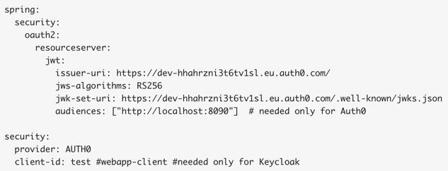
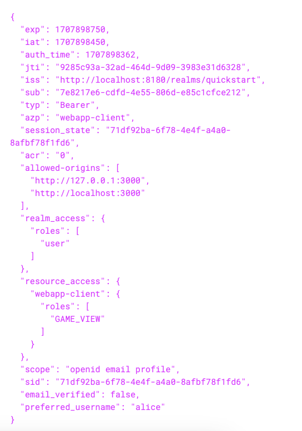

# auth-service-multi-provider-poc

**Build**  
* ./auth-service/gradlew --build-file auth-service/build.gradle --settings-file auth-service/settings.gradle bootBuildImage
* ./resource-server/gradlew --build-file resource-server/build.gradle --settings-file resource-server/settings.gradle bootBuildImage
* docker-compose up

[Postman collection](Auth Service Multi Provider PoC.postman_collection.json)  
[Flowchart](https://miro.com/app/board/uXjVNv1fe_o=/)

**Keycloak conf**  
Login in Admin console as `admin/admin`.  
Login in app as `alice/alice`.  
As this user you should have the `GAME_VIEW` role, but not the `GAME_PLAY` one.

You can export Keycloak conf by running the following command in terminal. You can then find the exported files inside the container under the path `/tmp/export`.  
`docker exec -it auth-service-multi-provider-poc-keycloak-1 /opt/keycloak/bin/kc.sh export --dir /tmp/export`

**Auth Service**  
Acts as a wrapper for IAM providers, currently supporting Auth0 and Keycloak. Connections details, as well as client configuration can be found in `application.yml`.  
Supported operations:

- Construct authorize url
- Get token by exchanging authorization code
- Refresh token

**Resource Server**  
Provides the API that needs to be secured, requiring either `GAME_VIEW` or `GAME_PLAY` authorities.  
Spring security is configured to verify tokens coming from various providers, currently supporting Auth0 and Keycloak. Each IAM provider utilizes it own `JwtAuthenticationConverter` to process the token.

Additional logic can be added with custom decoder. Currently token validation consists of the following checks:
- token is not expired
- token has proper authorities
- issuer is correct
- audience (aka registered api url) or client id is correct
- signature has the expected algorithm and public key

Providers can be switched via properties, without changing any code.   
For **Auth0** the following properties are needed

and for **Keycloak**

**Token samples**  
Auth0

Keycloak

